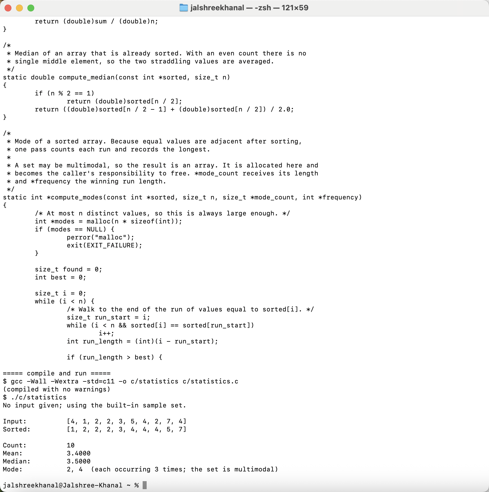
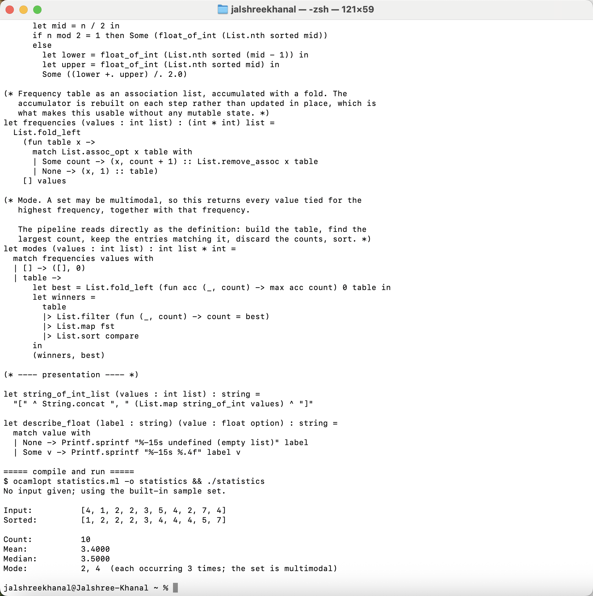
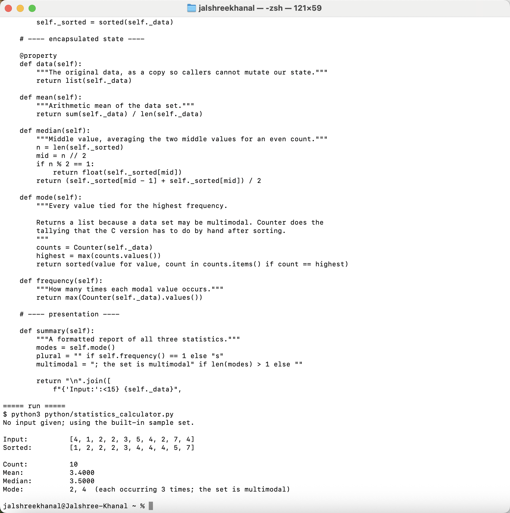
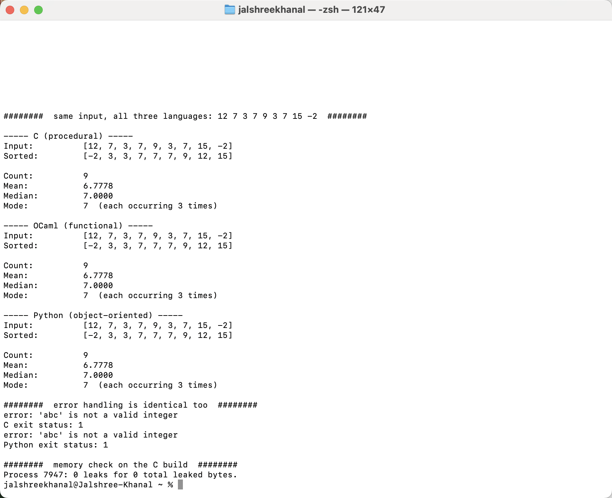

**Repository:** https://github.com/jalshreekhanal4-sketch/statistics-paradigms

The same problem — mean, median, and mode of a list of integers — was implemented three times, once procedurally in C, once functionally in OCaml, and once in an object-oriented style in Python. All three accept integers on the command line, fall back to a shared bimodal sample set, and print identical output. Solving one problem three ways made the differences between the paradigms unusually visible, because everything except the paradigm was held constant.

## Procedural: C

C required the most code, at 131 non-comment lines against 101 for OCaml and 89 for Python, and nearly all of the excess was work the other two languages absorb. Insertion sort and the mode scan were written out by hand, and memory was managed explicitly. The most instructive difficulty was returning the mode at all. A data set can be multimodal, so the answer is a variable-length list plus its frequency — three values — and a C function returns one. The signature ended up allocating an array internally and writing the count and frequency through pointer parameters, which works but relocates a fact the compiler cannot check into a comment: the caller must free the result. The error path was the other trap. Rejecting a bad argument mid-parse meant freeing the partially filled array before returning, and forgetting that single call would have leaked silently. Verifying that discipline required tools rather than reasoning, so the program was checked with `leaks` and rebuilt under AddressSanitizer and UndefinedBehaviorSanitizer; it reports zero leaks and runs clean.

## Functional: OCaml

The OCaml version contains no mutable state at all — no references, no mutable fields, no loops — and the discipline changed how the edge cases were handled rather than merely how the loops were written. Because `mean` and `median` return `float option`, the empty-list case is part of the type, and a caller cannot quietly ignore it the way a C caller can ignore a sentinel return. That single decision eliminated a class of bug instead of documenting it. The mode pipeline reads almost exactly as the definition of mode: build a frequency table, find the largest count, keep the entries matching it, discard the counts, sort. The real challenge was building that frequency table without a mutable dictionary. Folding an association list works and stays pure, but it rebuilds the accumulator on every element and is quadratic, where Python's hash-based `Counter` is linear. At ten elements this is irrelevant; at ten million it would not be, and the honest observation is that immutability here bought correctness at a real asymptotic cost. Smaller frictions were syntactic: OCaml keeps separate operators for integer and float arithmetic, and every mixed expression needs an explicit conversion, which the compiler enforces rather than guesses.

## Object-Oriented: Python

Python produced the shortest program, but the paradigm work was not in the arithmetic — `Counter` and `sorted` handle that in a line each. It was in the boundary around the data. The constructor copies the caller's list, validates it once, and caches the sorted form, so no method has to revalidate and no later mutation by outside code can invalidate that cache. The data is exposed only through a read-only property that returns a copy. This is the inverse of the C approach: rather than documenting an invariant and trusting the programmer, the object makes the invariant structurally difficult to break. One subtlety cost me time — `bool` is a subclass of `int` in Python, so a naive `isinstance(value, int)` check accepts `True` and `False` as data, and the validation needed an explicit exclusion.

## Key Differences and Verification

The clearest pattern was where each paradigm locates its guarantees. C places them in the programmer's discipline, enforced by comments and external tooling. OCaml places them in the type system, where the compiler refuses to proceed. Python places them at the object boundary, protecting state by construction. None is strictly better: C exposed the machine and cost the most vigilance, OCaml made illegal states unrepresentable but forced an inefficient data structure to stay pure, and Python was fastest to write while deferring every check to runtime.

To confirm the three were genuinely equivalent rather than merely similar, they were run against 306 data sets — hand-chosen edge cases including single elements, all-identical values, negatives, and both parities of length, plus 300 randomized sets — and produced byte-identical output on every one, with matching error messages and exit statuses on invalid input.

## Appendix: Sample Output and Source Code

